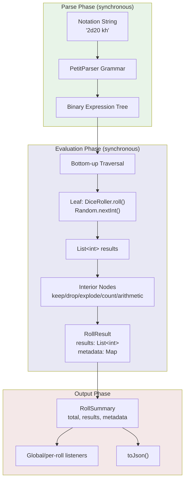
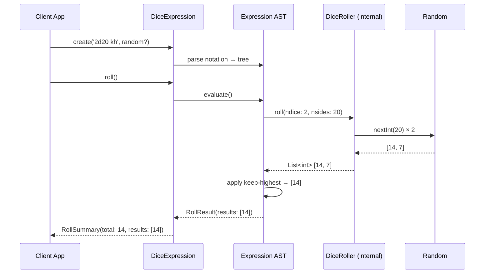
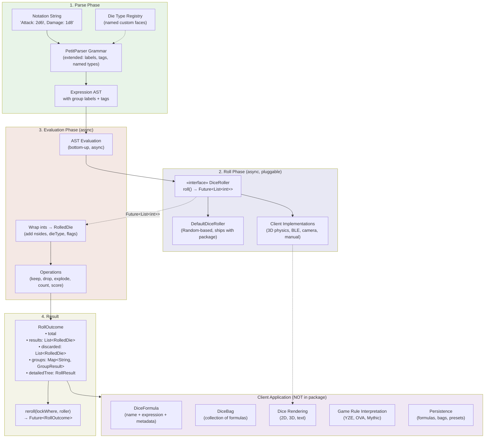
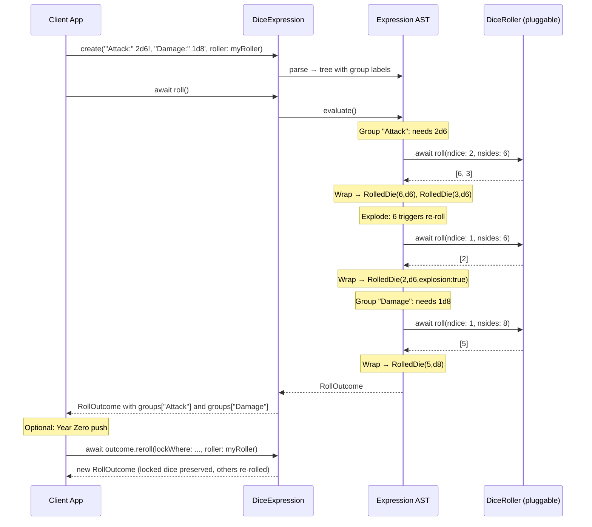
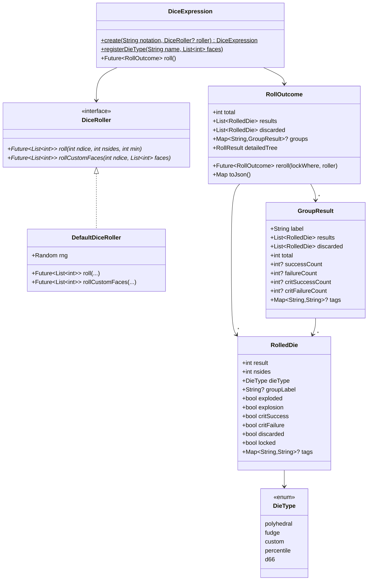
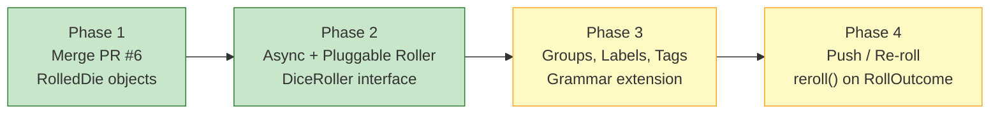

# Mythic Dice Parser: Conversion & Architecture Spec

**Status:** Draft v2  
**Date:** 2026-03-15  
**Author:** Claude (for Jason Holt Digital)  
**Repo:** `kingdomseed/mythic-dice-parser` (fork of `Adventuresmith/dart-dice-parser`)  
**Upstream:** `Adventuresmith/dart-dice-parser` — PR #6 (RolledDie objects), PR #7 (async/custom roller)

-----

## Agent Instructions

This document is designed to be handed to an autonomous AI agent working in a VM with full repo access. The agent should:

1. Clone `kingdomseed/mythic-dice-parser` and the upstream `Adventuresmith/dart-dice-parser`
1. Check out PR #6 branch (`roll-results-obj`) and PR #7 branch (`custom-dice-roller`) from upstream
1. Read all source code — the current `main` branch AND both PR branches
1. Use this spec as the authoritative target, but validate every claim against the actual code
1. Flag any discrepancies between this spec and the actual PR code
1. Produce implementation plans per phase with concrete file-level diffs

**Critical context:** The upstream author (Steve) is an expert engineer. His code is high-quality and well-structured. Our goal is to absorb his work cleanly and extend it — not to redesign his architecture. Where this spec proposes changes that conflict with patterns Steve established, prefer Steve’s patterns unless there’s a clear, stated reason to diverge.

-----

## Summary

The `dart_dice_parser` is a synchronous, integer-result dice engine. Two in-flight PRs address foundational limitations: PR #6 replaces plain `int` results with rich `RolledDie` objects, and PR #7 explores async evaluation with a pluggable dice roller. Community requests (Year Zero Engine, OVA, colored dice pools, named formulas, 3D dice, Bluetooth dice) require both PRs plus additional work around dice grouping and labeling.

This spec defines what changes belong in the **package** versus what the **client application** handles on top of it. The package’s job is to parse, evaluate, and produce richly-typed results. The client’s job is to render, persist, animate, and manage user-facing workflows built on those results.

-----

## Table of Contents

1. [Current Architecture](#1-current-architecture)
1. [Current Limitations](#2-current-limitations)
1. [User Requests → Limitation Mapping](#3-user-requests--limitation-mapping)
1. [Package vs Client Responsibility](#4-package-vs-client-responsibility)
1. [Design Decisions (Resolved)](#5-design-decisions-resolved)
1. [Target Architecture](#6-target-architecture)
1. [Implementation Phases](#7-implementation-phases)
1. [Call-Site & Testing Impact](#8-call-site--testing-impact)
1. [Future Considerations (Not Committed)](#9-future-considerations-not-committed)

-----

## 1. Current Architecture

### 1.1 How It Works Today

The parser converts a dice notation string into a binary expression tree (AST). Evaluation traverses bottom-up: leaf nodes roll dice via `Random`, interior nodes apply operations (keep, drop, explode, count, arithmetic). Results flow upward as `RollResult` objects containing `List<int>`.



### 1.2 Key Types (Current Release)

|Type            |Role                       |Contents                                                         |
|----------------|---------------------------|-----------------------------------------------------------------|
|`DiceExpression`|Public API entry point     |`create(String, [Random])` → parsed AST. `roll()` → `RollSummary`|
|`RollResult`    |Internal result node in AST|`results: List<int>`, `metadata: Map`, `left/right: RollResult?` |
|`RollSummary`   |Public result wrapper      |`total: int`, `results: List<int>`, `metadata: Map`              |
|`DiceRoller`    |Internal RNG wrapper       |Wraps `Random`, called by leaf nodes. Not exposed to clients.    |

### 1.3 Data Flow (Current)



-----

## 2. Current Limitations

Each limitation is assigned an ID for traceability throughout this document.

### L1: Results are plain integers — no die identity

`RollResult.results` is `List<int>`. A result of `6` carries no information about whether it came from a d6, d8, d20, fudge die, or custom-faced die. This blocks:

- Rendering the correct die shape in a UI
- Correct explosion after combining heterogeneous dice (Savage Worlds `(1d6+1d8)-L!`)
- Distinguishing fudge dice from regular dice in roller callbacks

**PR #6 addresses this** by introducing `RolledDie` objects carrying `result`, `nsides`, `dieType`, and boolean state flags.

### L2: Synchronous-only evaluation

`roll()` is synchronous. The entire evaluation must complete in a single call stack. This blocks:

- 3D physics dice (result determined by animation settling)
- Bluetooth dice (result arrives over BLE after physical roll)
- Any result source that requires user interaction or I/O

**PR #7 addresses this** by making `roll()` return `Future` and accepting a custom roller.

### L3: No pluggable DiceRoller interface

The rolling mechanism is internal. Clients can supply a `Random` instance but cannot replace the rolling logic itself. This prevents:

- Physics-based rolling (3D dice)
- External hardware rolling (Bluetooth dice, camera-read physical dice)
- Custom probability distributions
- Analytics/instrumentation wrapping

**PR #7 addresses this** by extracting `DiceRoller` as an abstract class.

### L4: No dice pool identity / grouping / tagging

All dice in an expression are anonymous. There is no way to:

- Name groups: `"Attack:" 2d6 + "Damage:" 1d8`
- Color groups: Year Zero Engine’s white/red/black d6 pools
- Tag groups for post-roll filtering

**Not addressed by either PR.** PR #6 adds comma-separated sub-expressions (`(1d6!,1d8!)kh`) which is a structural prerequisite, but no labeling/tagging mechanism exists.

### L5: Results are always summed — no alternative aggregation

The engine’s default is to sum results into a `total`. No support for:

- Year Zero Engine: count only 6s and 1s, don’t sum
- OVA: group matching values, sum each group, take highest group total

Partially addressed by existing `#s`/`#f`/`#cs`/`#cf` scoring, but `total` is always a sum.

### L6: No re-roll-with-lock (push) mechanic

Year Zero Engine’s “push”: roll a pool, lock 6s and 1s, re-roll the rest. This is a multi-phase roll with state between phases. The engine has no concept of locking individual results or re-rolling a subset.

### L7: No named formulas

Users cannot assign a name to an expression. Formula management is entirely a client concern, but the engine provides no metadata hook for it.

### L8: No inline string labels in expressions

Users want `"Red:" 1d6 + "Green:" 1d6` producing labeled output. The parser grammar has no concept of string literals within expressions.

### L9: Custom faces limited to inline syntax

`2d[2,3,5,7]` works, but there’s no concept of named custom die types (e.g., a “Genesys Ability Die”) reusable by reference.

### L10: No dice bag / preset management at the engine level

No concept of saved dice configurations or grouped presets.

### L11: No event model for progressive result delivery

The listener system fires after each AST node evaluates, but there’s no “about to roll” event (needed for 3D dice to know what to animate) and no “phase complete” event for multi-step workflows.

### L12: No concurrency model for parallel sub-expression evaluation

Left and right AST branches evaluate sequentially. For 3D dice, multiple dice should animate simultaneously.

### L13: Roll method returns flattened RollSummary — full tree requires listeners or JSON

Accessing the full `RollResult` tree requires traversing `detailedResults` from JSON or registering listeners. The result tree should be more directly accessible.

### L14: Static global listener registration

`DiceExpression.registerListener()` is a static global. Cannot be scoped to a specific expression without using the per-roll `onRoll` parameter.

-----

## 3. User Requests → Limitation Mapping

|User Request              |Description                                              |Limitations Hit   |
|--------------------------|---------------------------------------------------------|------------------|
|**Year Zero Engine**      |Three colored d6 pools, count 6s/1s only, push re-roll   |L1, L4, L5, L6, L8|
|**OVA dice**              |Roll nd6, group matching values, sum groups, take highest|L5                |
|**Named formulas**        |`Ironsworn: 2d10+1d6`                                    |L7, L10           |
|**Inline string labels**  |`"Red:" 1d6 + "Green:" 1d6` with labeled output          |L4, L8            |
|**Colored dice groups**   |Visual distinction per dice set                          |L1, L4            |
|**Dice bags**             |Saved configurations with metadata                       |L7, L9, L10       |
|**Custom named die types**|Reusable face definitions                                |L9                |
|**3D animated dice**      |Physics-simulated on-screen rolling                      |L2, L3, L11, L12  |
|**Bluetooth dice**        |External hardware provides results                       |L2, L3, L11       |
|**Physical dice (camera)**|OCR/camera reads die results                             |L2, L3            |
|**Savage Worlds**         |`(1d6+1d8)-L!` explode after combining                   |L1                |

-----

## 4. Package vs Client Responsibility

This is the most important section of this document. Every feature request decomposes into work that belongs in the dice parser package versus work that belongs in the consuming application (Mythic GME). The boundary is: **the package parses, evaluates, and produces richly-typed structured results. The client renders, persists, animates, and manages user workflows.**

### 4.1 Responsibility Matrix

|Capability                        |Package Responsibility                                                                                                 |Client Responsibility                                                                                       |
|----------------------------------|-----------------------------------------------------------------------------------------------------------------------|------------------------------------------------------------------------------------------------------------|
|**Die identity** (L1)             |`RolledDie` carries `nsides`, `dieType`, state flags                                                                   |Render correct die shape, color, animation based on `RolledDie` fields                                      |
|**Async rolling** (L2)            |`roll()` returns `Future`. AST evaluation is async.                                                                    |Manage async UI state (loading, result display)                                                             |
|**Pluggable roller** (L3)         |Define `DiceRoller` interface. Ship `DefaultDiceRoller`.                                                               |Implement `Physics3DDiceRoller`, `BluetoothDiceRoller`, etc.                                                |
|**Dice groups/labels** (L4, L8)   |Parse label/tag syntax. Preserve labels on `RolledDie`. Return per-group results in `RollOutcome`.                     |Render groups with colors/names. Map labels to visual styles.                                               |
|**Alternative aggregation** (L5)  |Support count-based scoring (`#s`/`#f`/`#cs`/`#cf` — already exists). Expose per-group scoring in results.             |Interpret scoring for game-specific rules (YZE counts 6s as successes, 1s as trauma). Display appropriately.|
|**Push / re-roll** (L6)           |`RolledDie` has a `locked` flag. Provide a method to re-roll unlocked dice from a previous result.                     |Decide lock criteria (game-rule-specific). Present lock/unlock UI. Trigger re-roll.                         |
|**Named formulas** (L7)           |Not a package concern. The package parses notation strings — it doesn’t manage collections of them.                    |`DiceFormula` model: name + expression string + metadata. Persistence, UI, organization.                    |
|**Named die types** (L9)          |Registry: `DiceExpression.registerDieType('ability', [1,1,2,2,3,3,4])` so expressions can reference `2dability`.       |Define game-specific die types at app startup. Manage die type libraries.                                   |
|**Dice bags / presets** (L10)     |Not a package concern.                                                                                                 |`DiceBag` model: collection of formulas + metadata. Persistence, sharing, organization.                     |
|**Progressive events** (L11)      |Callbacks/listeners with enough context for the client to react (what’s about to be rolled, what just resolved).       |Use events to drive animations, sound effects, progressive UI updates.                                      |
|**Parallel sub-expressions** (L12)|When using async roller, left and right branches can be evaluated concurrently (both `Future`s launched, then awaited).|Animate multiple dice simultaneously in the roller implementation.                                          |
|**Result tree access** (L13)      |Return full `RollResult` tree directly — not only via JSON or listeners.                                               |Traverse tree for detailed result rendering.                                                                |
|**Scoped listeners** (L14)        |Per-roll callbacks (already partially exists via `onRoll`). Deprecate global static registration.                      |Subscribe to events for specific rolls in the UI.                                                           |

### 4.2 The Guiding Principle

If the feature requires **parsing notation, evaluating dice math, or structuring result data** → it’s a package concern.

If the feature requires **rendering, persisting, animating, managing user preferences, or implementing game-specific rules** → it’s a client concern.

If the feature requires **an extension point where the client plugs custom behavior into the engine** → the package defines the interface, the client implements it.

### 4.3 What This Means Concretely

The package ships:

- `RolledDie` — rich result objects (PR #6)
- `DiceRoller` — abstract interface with `DefaultDiceRoller` (PR #7 rework)
- Async `roll()` — returns `Future<RollOutcome>`
- Group/label grammar — `"Label:" NdN` syntax parsed and preserved in results
- Tag passthrough — a simple `Map<String, dynamic>` on dice groups that the package carries but doesn’t interpret
- Push support — `RollOutcome.reroll(lockWhere: predicate, roller: roller)` returning a new result
- Named die type registry — so custom faces can be referenced by name in expressions
- Per-roll callbacks — scoped to individual roll invocations

The client builds:

- 3D dice rendering (implements `DiceRoller`)
- Bluetooth integration (implements `DiceRoller`)
- Camera/physical dice reading (implements `DiceRoller`)
- Dice bag management (persistence, UI)
- Named formula management (persistence, UI)
- Color/theme assignment per group (maps labels → visual styles)
- Game-specific rule interpretation (YZE success counting, OVA group-max)
- Animation choreography (subscribes to callbacks, drives rendering)
- Manual dice entry UI (implements `DiceRoller` — prompts user, returns input)

-----

## 5. Design Decisions (Resolved)

These were open questions in the v1 spec. Resolved by applying: separation of concerns, plugin best practices, minimal complexity, flexibility for multiple roll types, and opinionated defaults.

### D1: PR #6 Merge Strategy

**Decision:** Merge the `roll-results-obj` branch wholesale into our fork.

**Rationale:** Steve structured 31 commits with clear intent. Cherry-picking loses coherence and introduces integration risk. If the `diceui` Flutter package directory isn’t needed for the package itself, exclude it, but take everything else. Respect the author’s design decisions — they’re well-considered.

**Agent task:** Diff the branch against `main`, catalog every structural change, identify if `diceui` has any dependency coupling to the core library. If it doesn’t, it can be excluded from the fork. If it does, include it.

### D2: DiceRoller Interface Shape

**Decision:** `Future<List<int>>`, not `Stream<RolledDie>`.

```dart
abstract class DiceRoller {
  /// Roll [ndice] dice with values in range [min, nsides].
  /// Returns a Future that completes when all dice have landed.
  Future<List<int>> roll({
    required int ndice,
    required int nsides,
    int min = 1,
  });

  /// Roll [ndice] dice selecting from [faces].
  /// For fudge dice, custom dice, etc.
  Future<List<int>> rollCustomFaces({
    required int ndice,
    required List<int> faces,
  });
}
```

**Rationale:**

- The engine cannot evaluate anything until all dice in a sub-expression have landed. You can’t apply keep-highest to a partial result. So the engine always needs the complete list before proceeding.
- A `Stream<RolledDie>` would always be collected into a list before evaluation — making it a leaky abstraction that adds complexity with zero benefit at the engine layer.
- The roller returns raw `int`s. The engine wraps them into `RolledDie` objects with appropriate metadata (`nsides`, `dieType`, flags). Clean separation: the roller produces randomness, the engine interprets it.
- A 3D physics roller animates internally and resolves the Future when all dice settle. A Bluetooth roller waits for the physical roll and resolves when the result arrives. The engine doesn’t care about timing — it just awaits.
- Steve arrived at essentially this same shape in his PR #7 discussion comments. We’re confirming his instinct.

**What about progressive animation events?** The client’s `DiceRoller` implementation owns that. A `Physics3DDiceRoller` can expose its own animation stream internally. The package doesn’t need to know about it. The package just needs the final integers.

### D3: Sync Convenience Method

**Decision:** No. One API path: `Future<RollOutcome>`.

**Rationale:** `DefaultDiceRoller` completes synchronously, so `await` resolves instantly. The cost is syntactic (`await`), not performance. Two API surfaces means two test paths, two documentation sets, two mental models. KISS says pick one.

### D4: Backward Compatibility

**Decision:** Zero compatibility window. Break freely, update call sites, move on.

**Rationale:** This is a private fork for Mythic GME. We have one consumer: our app. No deprecation annotations, no compatibility shims, no dual APIs.

### D5: PetitParser Version

**Decision:** Use what Flutter stable supports. Steve rolled back to PetitParser 6.1.0 due to Flutter SDK dependency conflicts. Follow his lead.

**Agent task:** Verify current Flutter stable channel’s PetitParser compatibility. Document the version constraint.

### D6: Label/Tag Grammar Design

**Decision:** Design the grammar, but keep it minimal and concrete. Don’t speculate.

The comma separator from PR #6 gives us structural grouping. Labels attach to groups:

```
"Attack:" 2d6!, "Damage:" 1d8
```

Parses to two groups, each with a label and a sub-expression. The label is a quoted string followed by a colon, appearing before a dice sub-expression within a comma-separated list.

Tags are a simple key-value passthrough. The package parses them and attaches them to the group, but does not interpret them:

```
"Attack:" 2d6! @color=red, "Damage:" 1d8 @color=blue
```

**Agent task:** Review the PetitParser grammar in PR #6 (which adds comma support). Determine the minimal grammar extension needed for labels and tags that does not conflict with any existing tokens. Produce a concrete grammar diff.

**Important constraint:** Labels and tags are optional. Plain expressions like `2d6+4` must continue to work exactly as they do today, with no grouping overhead in the result unless grouping syntax is explicitly used.

### D7: Push Mechanic

**Decision:** Method on the result object, not grammar syntax.

Push is inherently interactive: the user decides which dice to lock based on what they see. That’s a runtime decision, not a parse-time expression. It belongs as a method on the result:

```dart
final pushed = await outcome.reroll(
  lockWhere: (die) => die.result == 6 || die.result == 1,
  roller: roller,
);
```

The package provides: `reroll()` method on `RollOutcome` that accepts a lock predicate and a roller, marks matching dice as `locked: true`, re-rolls the rest, and returns a new `RollOutcome`.

The client provides: the lock criteria (game-rule-specific), the UI for showing locked/unlocked state, and the trigger to push.

### D8: Aggregation Strategy

**Decision:** Not a new abstraction. The existing `#s`/`#f`/`#cs`/`#cf` scoring is the package’s aggregation mechanism. Per-group scoring is the extension.

The package already supports counting successes and failures as metadata. The extension is that with groups (D6), each group can have its own expression including its own scoring operators:

```
"Skill:" 3d6 #s>=5 #f=1, "Gear:" 2d6 #s>=5 #f=1, "Stress:" 1d6 #s>=5 #f=1
```

Each group evaluates independently and returns its own scoring counts. The client interprets these counts according to Year Zero Engine rules (or whatever system is active).

OVA’s “group matching values and take highest sum” is genuinely a different aggregation mode that doesn’t map cleanly to existing scoring operators. This is a future consideration — it requires a concrete implementation spike before we commit to an approach.

### D9: Named Die Type Registry

**Decision:** Package provides a simple static registry. Client populates it at startup.

```dart
DiceExpression.registerDieType('fate', [-1, -1, 0, 0, 1, 1]);
DiceExpression.registerDieType('genesys_ability', [0, 1, 1, 2, 0, 1, 1, 2]);

// Then in expressions:
final expr = DiceExpression.create('4dfate');
final expr2 = DiceExpression.create('2dgenesys_ability');
```

This is a thin layer over existing custom faces (`2d[-1,-1,0,0,1,1]`) — it just lets you reference them by name instead of inlining the values every time.

**Agent task:** Determine how the PetitParser grammar should handle `NdNAME` where NAME is a registered die type. The grammar currently matches `NdN` where the second N is a number, plus special cases like `dF`, `d%`, `D66`. Named types need to be a resolvable identifier.

-----

## 6. Target Architecture

### 6.1 Architecture Diagram (Post All Phases)



### 6.2 Target Data Flow



### 6.3 Target Type System



-----

## 7. Implementation Phases

### Phase Overview



Phases 1 and 2 are **build now**. Phases 3 and 4 are **build when driven by concrete feature work** (Year Zero Engine support, colored dice UI) but the design is settled and they can be picked up without further architectural decisions.

-----

### Phase 1: Merge PR #6 — RolledDie Object Model

**Package changes:**

- `RollResult.results` changes from `List<int>` to `List<RolledDie>`
- `RolledDie` carries: `result`, `nsides`, `dieType` (enum), boolean flags (`exploded`, `explosion`, `critSuccess`, `critFailure`, `discarded`)
- `RollResult` splits active results from discarded results
- `RollSummary` gains `critSuccessCount`, `critFailureCount`
- New syntax: sorting (`4d6 s`, `4d6 sd`), comma-separated sub-expressions, penetrating dice
- AST refactored into multiple files
- `DieType` enum: polyhedral, fudge, custom, percentile, d66

**Breaking changes to track:**

- Every call site reading `results` as `List<int>` must read `List<RolledDie>`
- `total` computation changes (was implicit sum of ints, now sums `RolledDie.result`)
- `metadata` structure changes (scoring moves to die-level flags)
- JSON output shape changes
- All test assertions on result values need updating

**Limitations resolved:** L1 (die identity), partially L13 (richer result data).

**Agent tasks:**

1. Merge `roll-results-obj` branch into fork `main`
1. Run all tests, catalog failures
1. Read every changed file and produce a summary of structural changes
1. Identify the `diceui` package — determine if it has coupling to core library
1. Document the new public API surface

-----

### Phase 2: Async + Pluggable DiceRoller

**Package changes:**

- `DiceRoller` becomes an abstract class (see D2 for shape)
- `DefaultDiceRoller` wraps `Random` — exact behavioral parity with current rolling
- All AST node `evaluate()` methods become async (`Future<RollResult>`)
- `DiceExpression.create()` accepts optional `DiceRoller` parameter
- `DiceExpression.create()` still accepts `Random` for backward ergonomics (wraps in `DefaultDiceRoller` internally)
- `roll()` returns `Future<RollOutcome>` (rename from `RollSummary` → `RollOutcome` to signal the breaking change)
- Per-roll `onRoll` callback preserved, adapted for async flow
- Static `registerListener` / `registerSummaryListener` preserved but documented as deprecated

**Breaking changes to track:**

- `roll()` return type changes to `Future<RollOutcome>`
- All call sites must `await`
- Internal AST evaluation becomes async throughout
- Test setup needs async handling

**Limitations resolved:** L2 (async), L3 (pluggable roller), L12 (parallel evaluation possible — left/right branches can be `Future.wait`’d), L14 (path toward per-roll scoping).

**Agent tasks:**

1. Review PR #7 branch for Saif’s implementation patterns — understand what he needed and why
1. Review Steve’s comments about the `Stream<int>` interface shape — this is close to what we want
1. Implement `DiceRoller` abstract class and `DefaultDiceRoller`
1. Convert all AST `evaluate()` methods to async
1. Add `DiceRoller` parameter to `DiceExpression.create()`
1. Ensure `DefaultDiceRoller` with seeded `Random` produces identical results to current behavior (critical for deterministic testing)
1. Run full test suite, make all tests async, verify deterministic behavior preserved

**Design constraint for parallel evaluation:** When the roller is `DefaultDiceRoller`, left and right branches can be evaluated sequentially (current behavior, deterministic). When a custom roller is provided, the engine may evaluate left and right concurrently via `Future.wait([left, right])`. This is an implementation detail — the agent should determine if this is worth the complexity vs. always-sequential. The critical requirement is that `DefaultDiceRoller` with a seeded `Random` produces deterministic, reproducible results regardless of evaluation order.

-----

### Phase 3: Groups, Labels, Tags

**Package changes:**

- PetitParser grammar extended for label syntax: `"Label:" <expr>` within comma-separated groups
- PetitParser grammar extended for tag syntax: `@key=value` after a dice sub-expression
- `RolledDie` gains optional `groupLabel: String?` and `tags: Map<String, String>?`
- `RollOutcome` gains `groups: Map<String, GroupResult>?` — populated only when labels are used
- `GroupResult`: label, results, discarded, total, scoring counts, tags
- When no labels/groups are used, behavior and result shape are identical to Phase 2 (no overhead)

**Breaking changes:** Additive only if implemented correctly. Existing expressions without labels produce results with `groups == null`. No existing behavior changes.

**Limitations resolved:** L4 (grouping), L8 (labels).

**Agent tasks:**

1. Study the PetitParser grammar (post-PR #6 merge) exhaustively
1. Identify all tokens and determine where label/tag syntax can be added without ambiguity
1. Design the minimal grammar extension
1. Implement parsing → AST representation → evaluation → result propagation
1. Test: plain expressions unchanged, labeled expressions produce correct groups, tags pass through

**Grammar design guidance:**

- Labels are optional, quoted strings followed by colon: `"Attack:" 2d6`
- Tags are optional, `@key=value` after a sub-expression: `2d6 @color=red`
- Comma separates independent groups: `"A:" 2d6, "B:" 1d8`
- A group without a label still works: `2d6, 1d8` (two anonymous groups)
- When there’s only one group with no label, result is flat (no groups map)
- Labels and tags are metadata — they do not affect evaluation logic

-----

### Phase 4: Push / Re-roll Mechanic

**Package changes:**

- `RolledDie` gains `locked: bool` field (default `false`)
- `RollOutcome` gains `reroll()` method:

```dart
/// Re-roll unlocked dice. Locked dice are preserved in the new result.
/// [lockWhere] determines which dice to lock (true = lock, false = re-roll).
/// Returns a new RollOutcome — does not mutate the original.
Future<RollOutcome> reroll({
  required bool Function(RolledDie) lockWhere,
  required DiceRoller roller,
});
```

- The returned `RollOutcome` contains locked dice (unchanged, `locked: true`) and freshly rolled dice
- `reroll()` can be called multiple times on successive results (multi-push)
- Group structure is preserved across re-rolls

**Breaking changes:** Additive only. New field on `RolledDie` defaults to `false`.

**Limitations resolved:** L6 (push mechanic).

**Agent tasks:**

1. Implement `locked` field on `RolledDie`
1. Implement `reroll()` on `RollOutcome`
1. Test: lock specific dice, re-roll others, verify locked dice unchanged
1. Test: multi-push (push twice), verify correct behavior
1. Test: push preserves group structure
1. Test: push works with custom `DiceRoller` (mock roller returns known values)

-----

## 8. Call-Site & Testing Impact

### 8.1 Mythic GME App Integration Points

|Call Site                            |Current Usage                 |Phase 1 Impact                                                                            |Phase 2 Impact                                                                                                             |
|-------------------------------------|------------------------------|------------------------------------------------------------------------------------------|---------------------------------------------------------------------------------------------------------------------------|
|`diceRandomProvider`                 |Returns `Random?` for DI      |No change                                                                                 |Returns `DiceRoller` (wrapping `Random?`). Or: keep `Random?` and have `DiceExpression.create()` wrap internally — simpler.|
|`DiceExpression.create(expr, random)`|Synchronous, accepts `Random?`|No change (PR #6 preserves this)                                                          |Add `roller:` named param. Keep positional `Random?` for ergonomics (wraps internally).                                    |
|`expression.roll()`                  |Sync, returns `RollSummary`   |Result type has richer `RolledDie` objects. Update any code reading `results[i]` as `int`.|Returns `Future<RollOutcome>`. Add `await` everywhere.                                                                     |
|Fate question resolution             |Reads `total` from result     |`total` still exists, no change                                                           |Add `await`                                                                                                                |
|Dice roller UI                       |Displays results              |Update to read `RolledDie.result`, optionally render die type/shape                       |Add `await`. Future: subscribe to roller events for animation.                                                             |
|Integration tests                    |`Random(42)` for determinism  |Update assertions for `RolledDie`                                                         |`DefaultDiceRoller(Random(42))` — same determinism. Or: keep `Random(42)` passed to `create()` which wraps internally.     |

**Recommended migration for `diceRandomProvider`:** Keep it returning `Random?`. Have `DiceExpression.create()` accept both `Random?` (convenience, wraps in `DefaultDiceRoller`) and `DiceRoller` (explicit). This minimizes disruption for Phase 2. When the app wants 3D dice or Bluetooth, it provides a `DiceRoller` implementation instead.

### 8.2 Test Evolution

```dart
// ── BEFORE (current main) ──────────────────────────────────
test('roll 2d6', () {
  final expr = DiceExpression.create('2d6', Random(42));
  final result = expr.roll();
  expect(result.total, 7);
  expect(result.results, [4, 3]);
});

// ── AFTER Phase 1 (RolledDie) ──────────────────────────────
test('roll 2d6', () {
  final expr = DiceExpression.create('2d6', Random(42));
  final result = expr.roll();
  expect(result.total, 7);
  expect(result.results.map((d) => d.result), [4, 3]);
  expect(result.results.every((d) => d.nsides == 6), isTrue);
  expect(result.results.every((d) => d.dieType == DieType.polyhedral), isTrue);
});

// ── AFTER Phase 2 (async) ──────────────────────────────────
test('roll 2d6', () async {
  final expr = DiceExpression.create('2d6', Random(42));
  final result = await expr.roll();
  expect(result.total, 7);
  expect(result.results.map((d) => d.result), [4, 3]);
});

// ── Phase 2: custom roller ─────────────────────────────────
test('roll with mock roller', () async {
  final mockRoller = MockDiceRoller();
  when(() => mockRoller.roll(
    ndice: 1, nsides: 6, min: 1,
  )).thenAnswer((_) async => [5]);

  final expr = DiceExpression.create('1d6', roller: mockRoller);
  final result = await expr.roll();
  expect(result.total, 5);
});

// ── AFTER Phase 3 (groups) ─────────────────────────────────
test('labeled dice groups', () async {
  final expr = DiceExpression.create(
    '"Attack:" 2d6, "Damage:" 1d8',
    Random(42),
  );
  final result = await expr.roll();

  expect(result.groups, isNotNull);
  expect(result.groups!['Attack']!.results.every((d) => d.nsides == 6), isTrue);
  expect(result.groups!['Damage']!.results.every((d) => d.nsides == 8), isTrue);
  // Flat results still contain all dice
  expect(result.results.length, 3); // 2 + 1
});

// ── AFTER Phase 4 (push) ──────────────────────────────────
test('year zero push', () async {
  final expr = DiceExpression.create('5d6', Random(42));
  final initial = await expr.roll();

  final pushed = await initial.reroll(
    lockWhere: (die) => die.result == 6 || die.result == 1,
    roller: DefaultDiceRoller(Random(99)),
  );

  // Locked dice preserved
  for (final d in pushed.results.where((d) => d.locked)) {
    expect(d.result == 6 || d.result == 1, isTrue);
  }
  // Unlocked dice were re-rolled (values may differ)
  expect(pushed.results.length, initial.results.length);
});
```

-----

## 9. Future Considerations (Not Committed)

These are ideas that surfaced during analysis. They are **not part of the implementation plan**. They exist here so future work has context, not commitments.

### OVA Aggregation

OVA’s “group matching values, sum each group, take highest” is a genuinely different aggregation mode. It doesn’t map to existing scoring operators. When this is needed:

- Research whether it’s a new operator in the grammar (`4d6 ova`?) or a post-processing function on `RollOutcome`
- It probably belongs as a client-side post-processor on `RollOutcome.results`, not a package concern — the package returns individual die results, the client applies game-specific math

### Event/Callback Enrichment

The current listener system works. If 3D dice or Bluetooth integration reveals that clients need richer events (e.g., “about to roll 3d6” before rolling, not just “3d6 was rolled”), we can add a `RollObserver` interface that the `DiceRoller` implementation calls. But this should be pulled by real need, not pushed speculatively.

### Named Die Type Grammar

Decision D9 proposes `4dfate` syntax. This may conflict with existing parsing. The agent should research this thoroughly but treat it as Phase 3+ work — it’s not blocking anything in Phases 1-2. In the meantime, `4d[-1,-1,0,0,1,1]` works.

### Dice Formula & Dice Bag Models

These are pure client concerns. If they prove useful as shared models (e.g., multiple Word Mill apps sharing formula definitions), they could become a separate tiny package. But they should start as app-level models, not in the dice parser package.

### Alternative Scoring for Alternative Totaling

Some game systems want the `total` to be “number of successes” rather than “sum of faces.” The existing scoring operators (`#s>=5`) already count successes but put them in metadata, not `total`. A future enhancement could allow the total to be derived from scoring counts. This is a small targeted change when needed — not an abstraction overhaul.